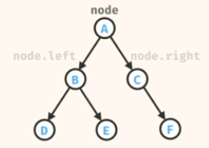
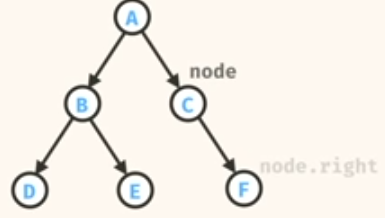
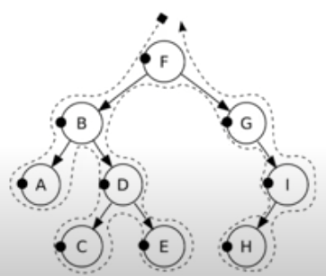

## Binary Tree
A binary tree is a tree data structure in which each node has at most two children, which are referred to as the left child and the right child.

We coudl store values in the nodes of our tree. Any type. 

A binary is at least:
- At most 2 children per node
- exactly 1 root
- exactly 1 path b/w root and any node

A leaf node has no children.
If there are no nodes, you should still consider this, and consider it as an empty tree. This is useful for edge cases

The tree cannot contain cycles.

E has no left and no right, so represent it with NULL values.

## Traversals

Traversing the tree is the key computation to all the nodes of a tree.
Unlike Linked list, trees may be traversed in multiple ways. They may be traversed in Depth First or Breadth first order

### Depth-First Search
The depth first search traversals are Pre-order, 

#### Pre-Order Traversal
Pre-order traversal is to visit the root first. Then traverse the left subtree. Finally, traverse the right subtree. 
1. Check if the current node is null
2. Display the data part of the root(or current node)
3. Traverse the left subtree by recursively calling the pre-order function
4. Traverse the right subtree by recursively calling the pre-order function.

Pre-order: F, B, A, D, C, E, G, I, H

#### Inorder Traversal
NOTE: This is the most common interview question.
In-order traversal means to "visit" (often, print) the left branch, then the current node, and finally, the right 
branch. 
1. Check if the current node is empty/null
2. Traverse the left subtree by recursively calling the in-order function.
3. Display the data part of the root(or current node)
4. Traverse the right subtree by recursively calling the in-order function.

In-order: A,B,C,D,E,F,G,H,I

Reference: [Binary Trees by LucidProgramming](https://docs.google.com/presentation/d/1OPqeIRnRyYLpFQPk7Wf0qmCUe-cMmAsI1hUqpab0B_s/edit#slide=id.p)

### Difference between Binary Tree and Binary Search Tree:  

BINARY TREE	BINARY SEARCH TREE
BINARY TREE is a non linear data structure where each node can have atmost two child nodes	BINARY SEARCH TREE is a node based binary tree which further has right and left subtree that too are binary search tree.
BINARY TREE is unordered hence slower in process of insertion, deletion, and searching.	Insertion, deletion, searching of an element is faster in BINARY SEARCH TREE than BINARY TREE due to the ordered characteristics
IN BINARY TREE there is no ordering in terms of how the nodes are arranged	IN BINARY SEARCH TREE the left subtree has elements less than the nodes element and the right subtree has elements greater than the nodes element.